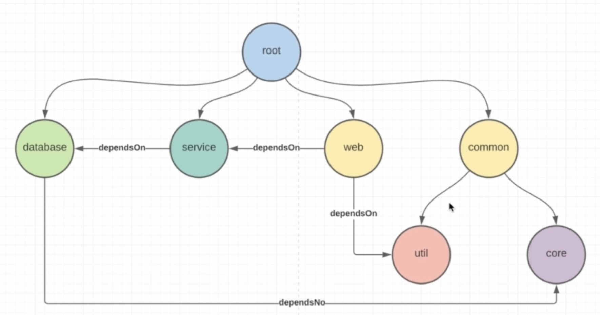

# Gradle Examples

---
## Description
This repository contains sample gradle projects
to show the variety of functionalities that Gradle offers
such as:
- tasks
- task Graph and task dependency
- plugins
- custom dependencies and configuration
- multi-project builds

### [Gradle Starter](https://github.com/baggio1103/gradle-project-samples/tree/main/gradle-starter)
This is a simple gradle project that shows how to create
simple tasks and organize dependencies between them and 
their order of execution. This is a perfect example to
see how tasks work.
The project has a Main.java class that is execution entry point and
the build.gradle.kts has scripts on how to create jar file and 
that contains the source code and dependent libraries that are used.

### [Tomcat WebApp War](https://github.com/baggio1103/gradle-project-samples/tree/main/tomcat-webapp-war)
A sample project that implements a ServletApi and generates a war file for running
on top of Tomcat. In this project, the build.gradle.kts shows how to write the
scripts to generate compileOnly classes and copy the war file to tomCat webApps folder.

### [Gradle Multi-project Build Project](https://github.com/baggio1103/gradle-project-samples/tree/main/gradle-multiproject)

A sample project that demonstrates the power of gradle multi-project builds. This 
project implements all the seven projects you can see on the picture 
and dependencies between each other:

- root - the main root project that configures the whole project
- common - a subproject that has two subprojects in turn
- core - a project that stores all the models
- util - a project that acts as an additional library
- database - a project that simulates the interaction with a database
- service - a project that simulates or handles all the business logic
- web - a project that implements Servlet Api and handles incoming requests

As you can see the projects depend on each other and each project
has its own build.gradle.kts files that configure all these
dependencies between projects (/ module)